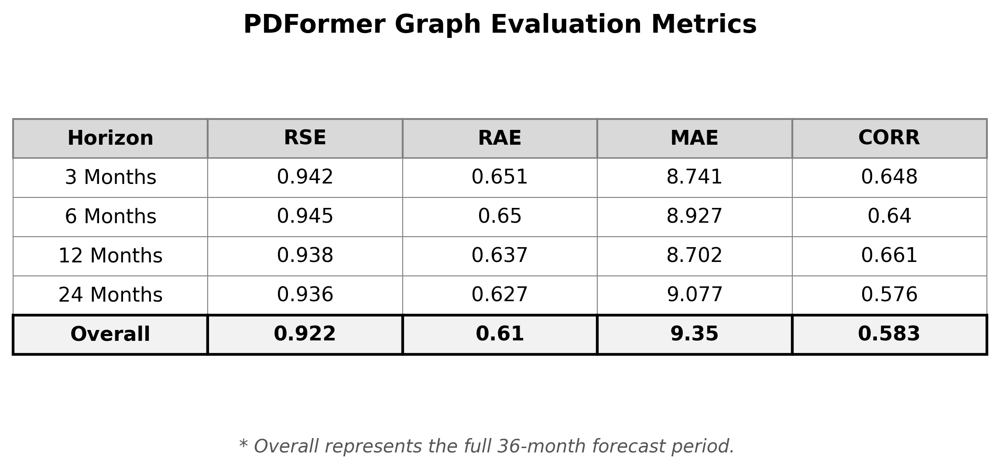
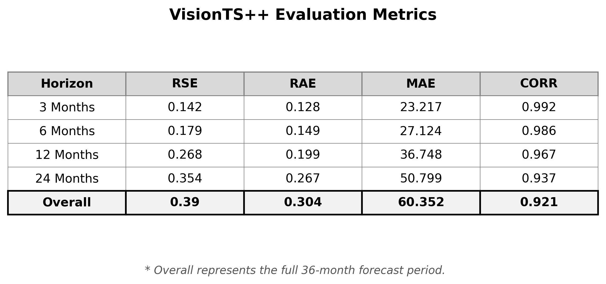
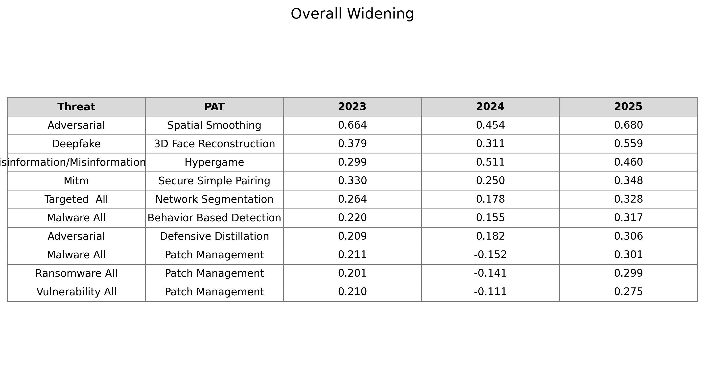
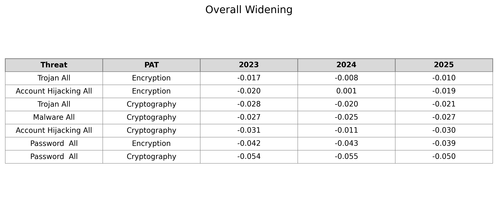
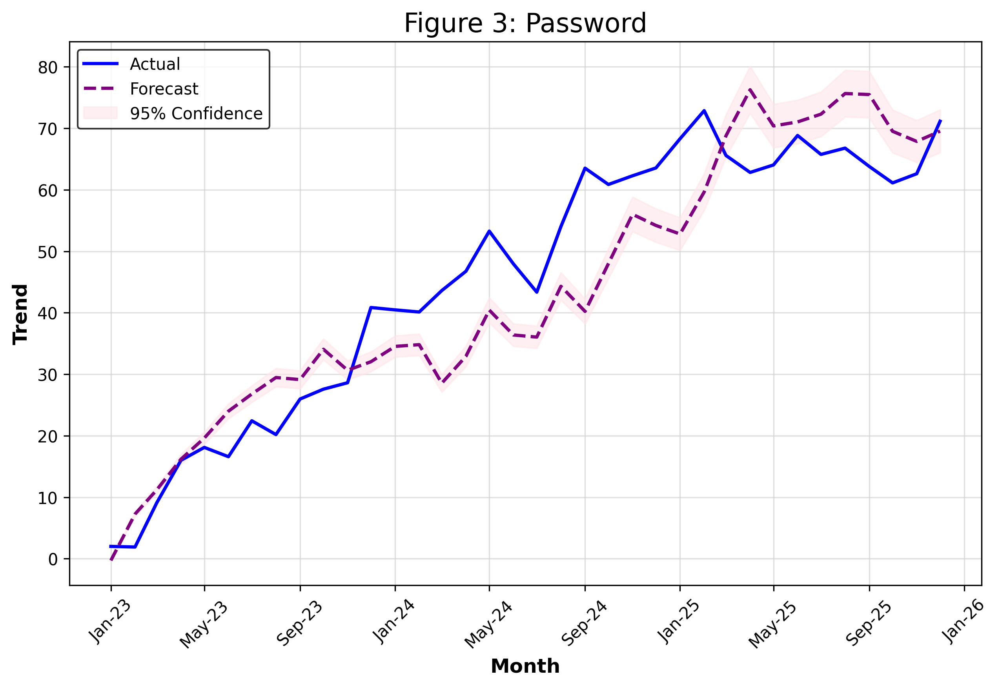
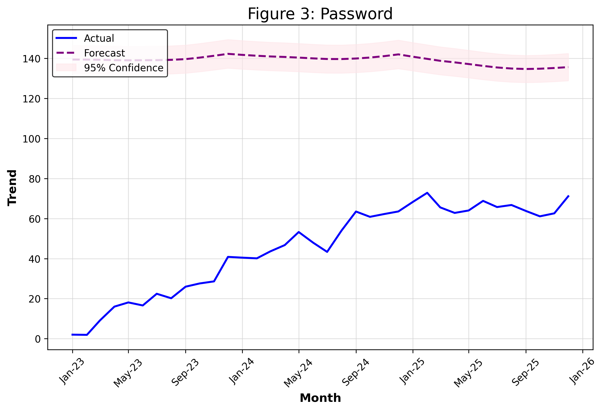
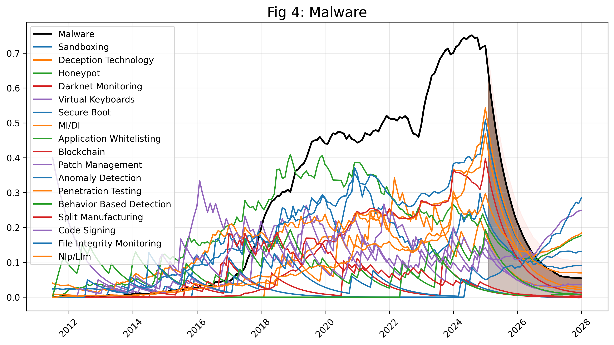
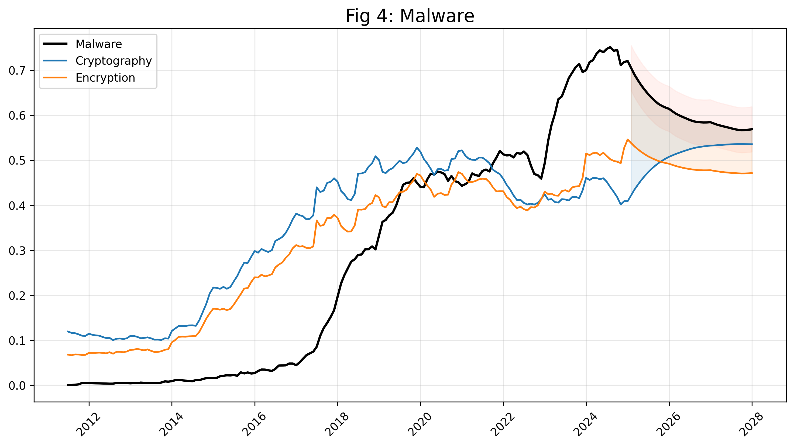

# Notebook Vignettes

This directory contains Jupyter notebooks used for verifying pipeline logic, visualising data transformations, and interactively running the end-to-end model architectures.

## Pipeline Verification Notebooks

### `Graph_Pipeline_Verification.ipynb`
**Purpose:** The primary test for the Graph (PDFormer) pipeline.
**Key Functions:**
* **Data Verification:** Visualises the `MMM-YY` date sorting and the effect of Double Exponential Smoothing (DES).
* **Tensor Shapes:** Confirms that the Preprocessing script generates strict 10-month input and 36-month target tensors.
* **Training Loop:** Runs a short, interactive training session to verify that the RSE/RAE metrics are calculating correctly and decreasing.

### `Vision_Pipeline_Verification.ipynb`
**Purpose:** The primary test for the Vision (VisionTS++) pipeline.
**Key Functions:**
* **Data Verification:** Visualises the `CONTEXT_LEN` and `PRED_LEN` time axes to ensure historical data stitches into the forecast horizon.
* **Image Tensors:** Validates that the multi-variate time series data is correctly rendered into the shared 2D image space required by the VisionTS architecture.
* **Training Loop:** Executes an isolated training pass through the Masked Autoencoder (MAE) to verify loss reduction and correlation metrics.

## End-to-End Vignette Dashboards

### `Transformer_Pipeline_Vignette_Graph.ipynb`
**Purpose:** Pipeline dashboard and demonstration tool for the Graph project. Executes the end-to-end workflow (Data Prep → Train → Eval → Vis) and is designed to run on both Google Colab and the natogpu server.
**Key Functions:**
* **Environment Switching:** Automatically detects the runtime (Colab vs. Local) and handles drive mounting, pathing, and dependencies accordingly.
* **Data Regeneration:** Capability to re-run the graph data generation process to ensure input tensors are built from the latest source CSVs.
* **Pipeline Manager:** Sequentially executes the full model pipeline (`Train_Graph.py`, `Evaluate_Graph.py`) utilizing a Best-of-N initialization loop for stability.
* **Interactive Visualisations:** A modular dashboard presenting results across four distinct layers (Broad Analysis, Validation Figures, Risk Tables, Continuous Trends).

### `Transformer_Pipeline_Vignette_Vision.ipynb`
**Purpose:** Pipeline dashboard and demonstration tool for the VisionTS++ model. Executes the exact same end-to-end workflow as the Graph Vignette but leverages an image-conversion Masked Autoencoder architecture.
**Key Functions:**
* **Universal Setup:** Colab/Local auto-detection and directory management.
* **Vision Processing:** Generates 2D image-space representations of the 25 vignette features, safely bypassing upstream submodule bugs.
* **Pipeline Manager:** Executes the `Train_VisionPP.py` (Best-of-N loop) and evaluates the global best weights against the test set.
* **Publication-Ready Visualisations:** Uses plotting scripts to perfectly match the PDFormer visual output, allowing for direct 1:1 model comparison.

## Setup & Usage

* **Dependencies:** Ensure the full project requirements are installed, specifically `matplotlib`, `seaborn`, and `tqdm` for the visualisations.

    ```bash
    pip install -r ../requirements.txt
    ```
* **Pathing:** These notebooks include a `sys.path` setup block at the top to allow importing modules from the sibling directory (`../Transformer_Pipeline`). Please do not remove this block.

---

## Key Results & Visualisations

### 1. Global Evaluation Metrics
| Graph Model (PDFormer) | Vision Model (VisionTS++) |
| :---: | :---: |
|  |  |

### 2. Gap Analysis: Top Widening Risks
| Graph Model (PDFormer) | Vision Model (VisionTS++) |
| :---: | :---: |
|  |  |

### 3. Forecast Accuracy
| Graph Model (PDFormer) | Vision Model (VisionTS++) |
| :---: | :---: |
|  |  |


### 4. Continuous Trends: Malware Forecast
| Graph Model (PDFormer) | Vision Model (VisionTS++) |
| :---: | :---: |
|  |  |