# Mark 3 Phase: Cyber Trend Forecasting

This repository contains the data pipelines, model architectures, and evaluation dashboards for the Mark 3 phase of the cyber trend forecasting project. The objective is to forecast the volume of 26 target cyber threat vectors and their associated mitigation technologies.

## 1. Executive Summary & Dataset Specifications

The Mark 3 phase utilises an expanded and refined dataset. 

* **Dataset Link:** [`Data_Preparation/Cyber_Trend_Forecasting_All_v2_2_sarimax.csv`](../Data_Preparation/Cyber_Trend_Forecasting_All_v2_2_sarimax.csv)
* **Historical Observations:** 144 monthly steps (July 2011 to June 2023).
* **Feature Columns:** 1,231 variables, encompassing threat events, defensive measures, and relevant macroeconomic indicators.

The data is processed via two distinct methodologies for comparative analysis: a graph adjacency matrix for the B-MTGNN architecture and 2D image-space patch projections for the VisionTS++ architecture.

## 2. Forecast Horizon & Methodology

* **Forecast Window:** 36 months (January 2026 to December 2028).
* **Smoothing Baseline:** An Exponential Moving Average ($\alpha = 0.05$) is uniformly applied to both models. This suppresses discrete step-variance and high-frequency noise inherent in graph-based models, whilst retaining the native magnitude scaling and wave dynamics of the vision-based outputs.

---

## 3. Results & Model Comparisons

All visualisations are pre-computed and stored in the `Processed_Data/Comparison_Plots/` directory. They can be viewed interactively via the `Vignette_Model_Comparison.ipynb` dashboard.

### 3.1 Global Evaluation Metrics (Table 9)

The following table presents the overarching performance metrics calculated against the test set for both models, capturing the Relative Squared Error (RSE) and Relative Absolute Error (RAE) across the forecasting horizons.

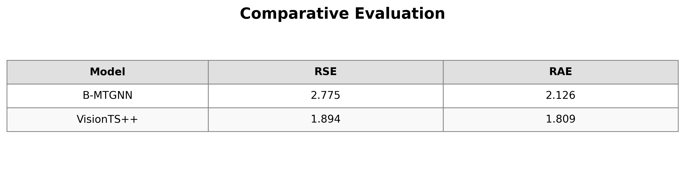

### 3.2 Model Validation: Forecast Accuracy (Figure 3)

These plots provide a breakdown of retrospective forecast accuracy, comparing the model predictions directly against the historical ground truth. 

**Malware Validation**
| B-MTGNN Model | Vision Model (VisionTS++) |
| :---: | :---: |
| 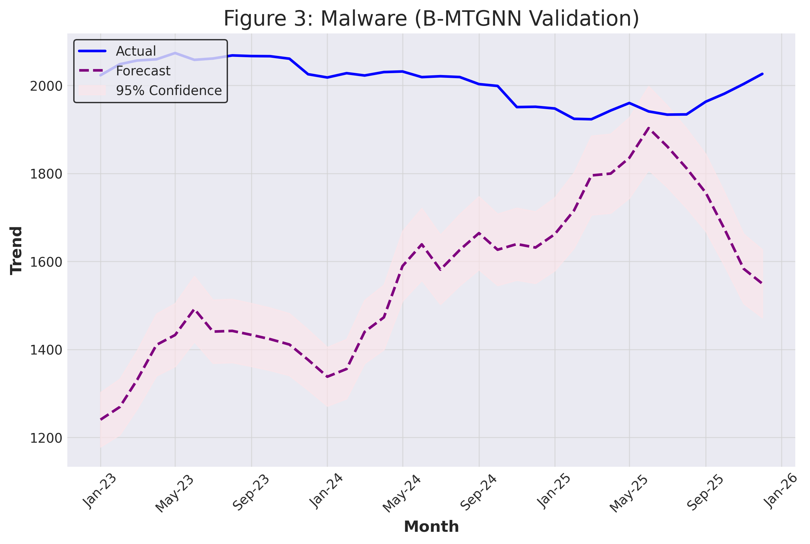 | 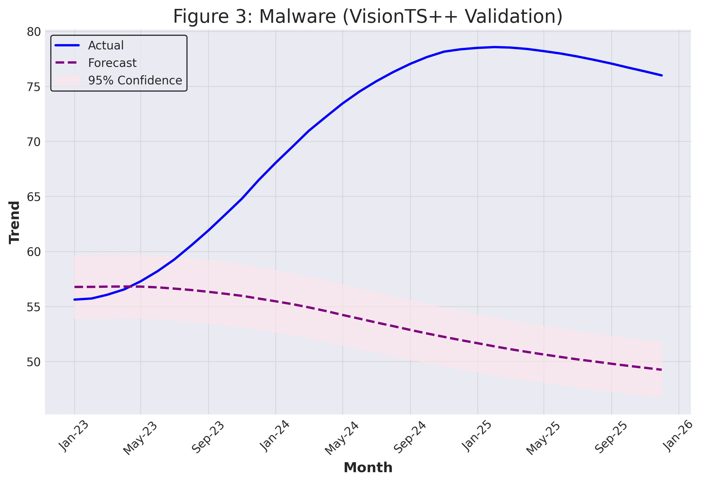 |

**Ransomware Validation**
| B-MTGNN Model | Vision Model (VisionTS++) |
| :---: | :---: |
| 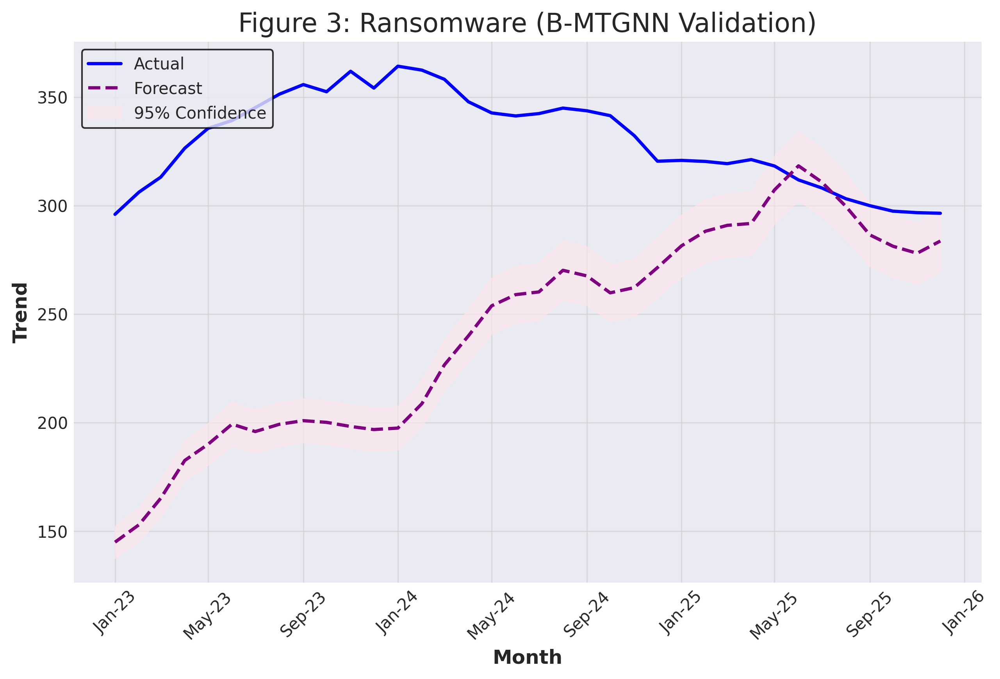 | 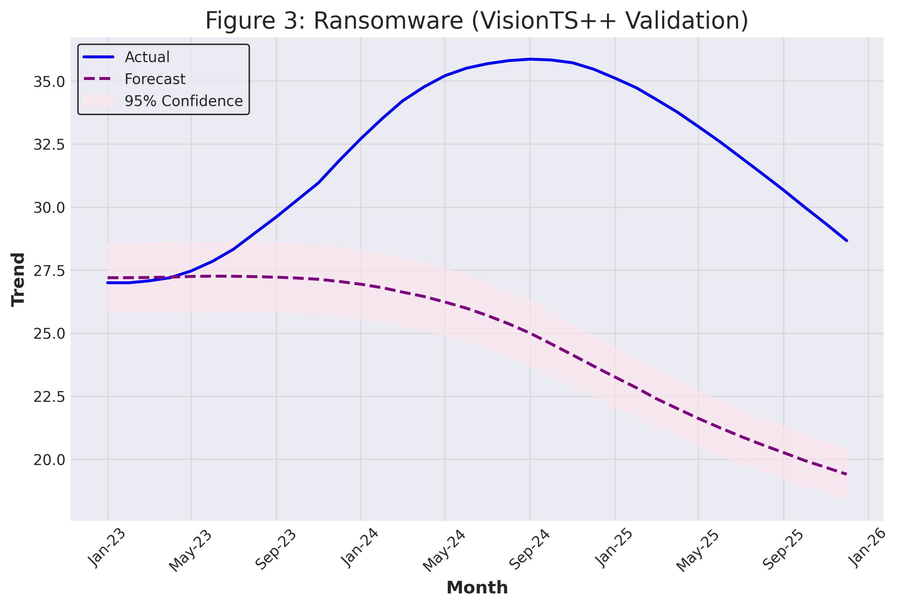 |

### 3.3 Continuous Trends Outlook (Figure 4)

These visualisations present the 36-month continuous trend forecasts (2026–2028) for cyber threat vectors plotted alongside their associated mitigation technologies.

**Malware Outlook**
| B-MTGNN Model | Vision Model (VisionTS++) |
| :---: | :---: |
| 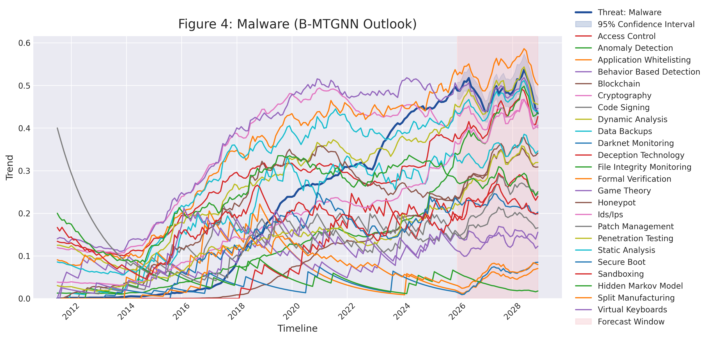 | 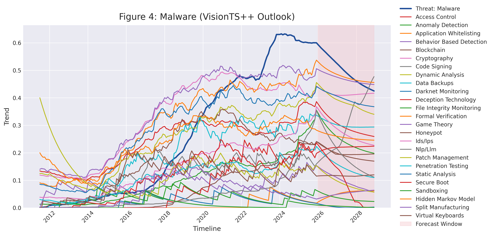 |

**Ransomware Outlook**
| B-MTGNN Model | Vision Model (VisionTS++) |
| :---: | :---: |
| 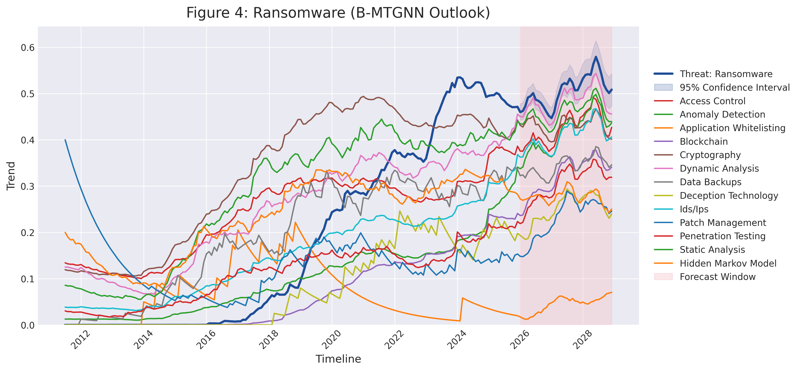 | 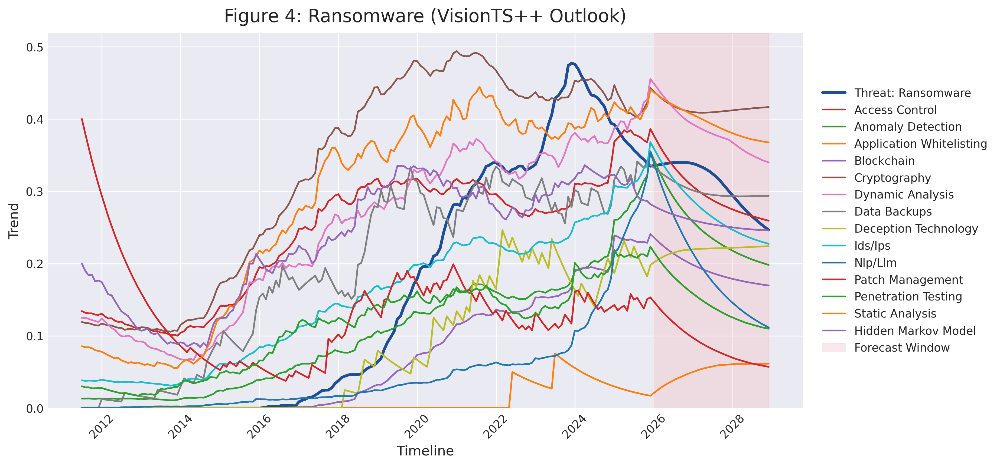 |

### 3.4 Gap Analysis

The gap analysis identifies specific intersections where the volume of attacks is projected to outpace the adoption or effectiveness of corresponding defensive measures (Widening Gaps), or where defensive measures are successfully closing the vulnerability window (Narrowing Gaps).

| B-MTGNN Model | Vision Model (VisionTS++) |
| :---: | :---: |
| 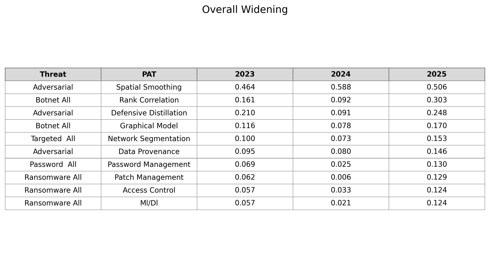 | 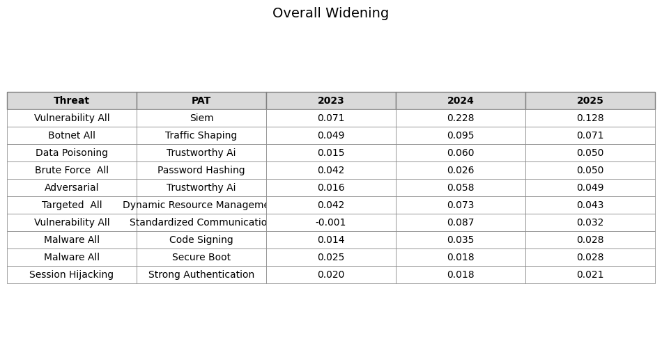 |

---

## 4. Pipeline Verification & Usage

This directory contains Jupyter notebooks used for verifying pipeline logic, visualising data transformations, and interactively running the end-to-end model architectures. 

### Setup & Usage

* **Dependencies:** Ensure the full project requirements are installed, specifically `matplotlib`, `seaborn`, and `tqdm` for the visualisations.

    ```bash
    pip install -r ../requirements.txt
    ```
* **Pathing:** These notebooks include a `sys.path` setup block at the top to allow importing modules from the sibling directory (`../Transformer_Pipeline`). Please do not remove this block.
* **Master CLI Execution:** The repository contains a unified master script intended to sequence preprocessing and training across all models. It can be executed from the root directory:

    ```bash
    python Run_Pipeline.py --model [vision/bmtgnn]
    ```
    *Note: The unified CLI wrapper is currently being updated for the Mark 3 dataset. For isolated execution, refer to the component scripts listed in the sections below.*

### Pipeline Verification Notebooks

#### `BMTGNN_Pipeline_Verification.ipynb`
**Purpose:** The primary unit test for the B-MTGNN pipeline.
**Key Functions:**
* **Data Preprocessing:** Executes the data generation script to build the required text-based time-series arrays and the graph adjacency matrix.
* **Tensor Shapes:** Confirms that the data loader generates the strict 10-month input and 36-month target dimensions.
* **Training Loop:** Runs a short verification training loop to check gradient calculations, dimensionality squeezing, and the calculation of validation RSE and RAE metrics.
* **Terminal Execution:** The verification functions can be run independently from the root directory:
    ```bash
    python B-MTGNN/Prep_Unsmoothed_Data.py
    ```

#### `Vision_Pipeline_Verification.ipynb`
**Purpose:** The primary test for the VisionTS++ pipeline.
**Key Functions:**
* **Data Verification:** Visualises the `CONTEXT_LEN` and `PRED_LEN` time axes to ensure historical data stitches into the forecast horizon.
* **Image Tensors:** Validates that the multi-variate time series data is rendered into the shared 2D image space required by the VisionTS architecture.
* **Training Loop:** Executes an isolated training pass through the Masked Autoencoder (MAE) to verify loss reduction and correlation metrics.
* **Terminal Execution:** The vision data generation can be run independently:
    ```bash
    python Transformer_Pipeline/Preprocessing/Cyber_Trend_to_Image.py
    ```

### End-to-End Vignette Dashboards

#### `Vignette_BMTGNN.ipynb`
**Purpose:** The pipeline dashboard for the B-MTGNN model. Executes the full data ingestion, training, evaluation, and plotting workflow.
**Key Functions:**
* **Environment Switching:** Detects the runtime (Colab vs. Local) and handles drive mounting and dependencies.
* **Pipeline Manager:** Instantiates the custom data loader and passes the generated adjacency matrix to the B-MTGNN architecture for full-length training.
* **Terminal Execution:** The complete B-MTGNN pipeline can be run via the following component scripts from the repository root:
    ```bash
    python B-MTGNN/Prep_Unsmoothed_Data.py && python B-MTGNN/train.py --data data/sm_data.txt --epochs 50 --batch_size 16 && python B-MTGNN/Visualise_Comparison.py
    ```

#### `Vignette_VisionTS.ipynb`
**Purpose:** The pipeline dashboard for the VisionTS++ model. Executes the image-conversion Masked Autoencoder architecture workflow.
**Key Functions:**
* **Universal Setup:** Handles Colab/Local auto-detection and directory management.
* **Vision Processing:** Generates 2D image-space representations of the 25 vignette features.
* **Pipeline Manager:** Executes the Best-of-N training loop and evaluates the global best weights against the test set.
* **Terminal Execution:** The complete VisionTS++ pipeline can be run via the following component scripts from the repository root:
    ```bash
    python Transformer_Pipeline/Train_VisionPP.py --data_dir ../Processed_Data/visionpp --mode train --epochs 50 --num_runs 10 --batch_size 4
    python Transformer_Pipeline/Evaluate_VisionPP.py --data_dir ../Processed_Data/visionpp
    python Transformer_Pipeline/Visualise_VisionPP_Results.py
    ```

#### `Vignette_Model_Comparison.ipynb`
**Purpose:** A dashboard built to load and display the output visualisations from both B-MTGNN and VisionTS++ side-by-side for direct evaluation of the Mark 3 dataset.

---

## Appendix: Deprecated Models (Mark 2 Dataset)

*The following models were tested during the October 2025 – January 2026 phase but are no longer in active development for the Mark 3 dataset.*

### `Graph_Pipeline_Verification.ipynb`
**Purpose:** The primary test for the deprecated Graph (PDFormer) pipeline.
**Key Functions:**
* **Data Verification:** Visualises the `MMM-YY` date sorting and the effect of Double Exponential Smoothing (DES).
* **Tensor Shapes:** Confirms that the Preprocessing script generates 10-month input and 36-month target tensors.
* **Training Loop:** Runs a short, interactive training session to verify that the RSE/RAE metrics are calculating correctly.

### `Vignette_PDFormer.ipynb`
**Purpose:** Pipeline dashboard and demonstration tool for the deprecated PDFormer project. 
**Key Functions:**
* **Environment Switching:** Automatically detects the runtime (Colab vs. Local) and handles drive mounting.
* **Pipeline Manager:** Sequentially executes the full model pipeline utilizing a Best-of-N initialization loop for stability.
* **Interactive Visualisations:** A modular dashboard presenting results across four distinct layers.